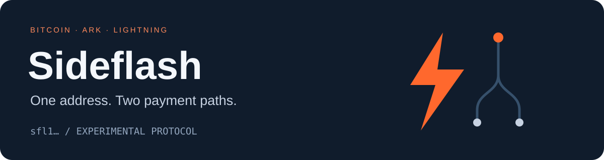
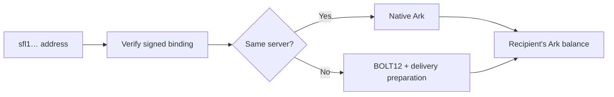

<p align="center"></p>

<p align="center"><a href="docs/protocol.md">Protocol</a> · <a href="docs/address-v1.md">Address format</a> · <a href="docs/ark-integration.md">Ark integration</a> · <a href="docs/lightning-integration.md">Lightning integration</a></p>

Sideflash proposes one receive address for native Ark transfers and Lightning
payments on **bitcoin (XBT)**. This repository targets XBT specifically,
not SHA-256 BTC. An address starts with `sfl1`. A compatible sender uses native Ark
when both parties use the same server. Otherwise, it extracts an authenticated
BOLT12 offer and pays over Lightning. The recipient receives Ark value.

> **Experimental · Not audited · Not ready for real payments**
>
> Address encoding and authentication work in the prototype. Server payment
> coordination and end-to-end Sideflash recovery are not implemented yet.
> The format can change before a stable release. Never fund the test vectors.

## One destination, the appropriate route

| Sender | Intended payment path | Recipient |
| :--- | :--- | :--- |
| Ark wallet on the same server | Native Ark | Ark balance |
| Ark wallet on another server | Lightning-backed transfer | Ark balance |
| Lightning-only wallet | Extract BOLT12 offer and pay | Ark balance |

These are the intended paths. The prototype verifies addresses and selects
routes; it does not yet implement complete cross-server payments.



## Development at a glance

| Component | Status |
| :--- | :--- |
| Legacy v0 Rust codec and signatures | Implemented; unit tested |
| Compact embedded v1 codec and signed fixtures | Python fixture implementation; tests pass |
| Compact v1 ASP/wallet support | Rust migration outstanding |
| Synthetic QR checks (v0 and v1) | Passing; not physical camera tests |
| Existing payment/recovery prerequisites | [7 isolated tests passed](docs/payment-recovery-evidence.md) |
| Physical camera testing | Outstanding |
| Server coordination and conditional recovery | Still to implement |
| Independent security review | Outstanding |

The compact v1 examples retain the complete BOLT12 offer, Ark destination and
both signatures with no address lookup: **785 characters instead of 911** for
the mainnet fixture, and **841 instead of 967** for regtest. Network profiles are
built into the codec. Version 0 remains documented for existing prototypes;
version 1 requires new signatures and is not deployed in ASP/wallet releases.

## Run the fixture checks

Use Python 3.12 in a virtual environment:

```sh
python -m pip install -r tests/requirements.txt
python tests/verify_vectors.py
python tests/test_compact_v1.py
```

See [test scope and limitations](tests/README.md). Fixture checks are not
end-to-end payment or recovery tests.

## Read the protocol

- [XBT network and feature requirements](docs/xbt-profile.md)
- [Protocol overview and payment lifecycle](docs/protocol.md)
- [Development address wire specification](docs/address-v1.md)
- [Ark server and wallet integration](docs/ark-integration.md)
- [Lightning wallet and node integration](docs/lightning-integration.md)
- [Security requirements and acceptance tests](docs/security-and-tests.md)
- [Implementation status and open decisions](docs/status.md)
- [Stability decisions and evidence](docs/stability-decisions.md)
- [Design whitepaper](whitepaper/sideflash-whitepaper.pdf)

This repository is the protocol discussion and integration reference. The
experimental Rust implementation lives in the
[Sideflash implementation branch](https://github.com/connorslab/paperclip-asp/tree/feature/sideflash).
Implementation-specific releases do not automatically stabilize this protocol.

The name prefix is `sfl`. The following `1` is the Bech32 separator, not a version.
Existing Ark addresses and BOLT12 offers retain their own formats and semantics.

## Scope

Sideflash defines destination authentication and payment route selection. It also
defines the requirements for safe delivery between independent Ark servers.
It is not a new blockchain, asset, consensus rule or public recipient directory.
It does not make Lightning channel balances into Ark backing or remove the need
for destination liquidity and recovery reserves.

Propose incompatible changes as a new profile. Include encoding vectors,
threat assumptions, failure behavior and compatibility consequences. The
development profile is not ready for external interoperability commitments.
