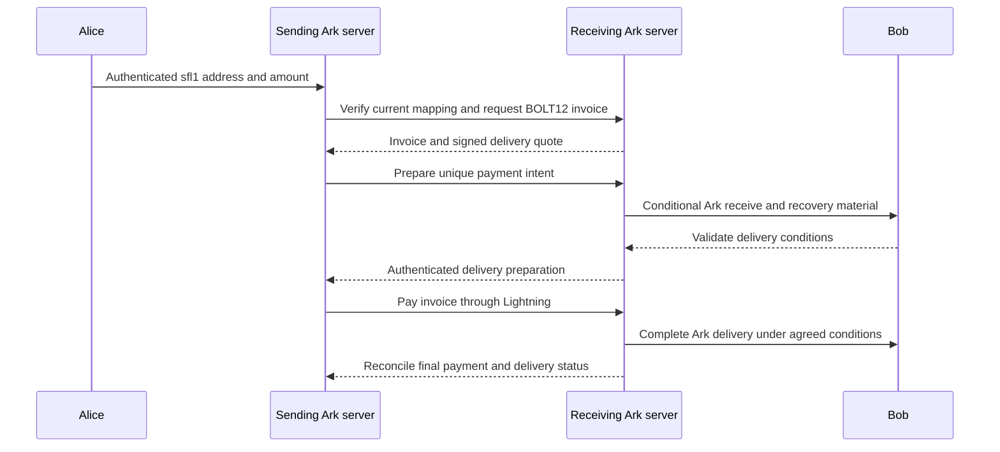

# Protocol and lifecycle

## Participants and destination

Alice is the payer; Bob is the recipient. A is Alice's Ark server, if she has
one. B is Bob's Ark server. A Lightning-only payer does not need A.

Bob's address binds his native Ark destination to one reusable BOLT12 offer.
It includes B's full public key, a network profile identifying chain genesis
and fork discriminator (explicit hashes in legacy v0), validity
interval and mapping revision. Bob signs the binding under his receiving policy.
B verifies and countersigns it. The signatures authorize a route; they do not
prove liquidity, current registration, or receipt of a VTXO.

The current profile embeds the complete offer. No server lookup is needed merely
to extract it. Resolver hints, delegated keys and compact lookup-only addresses
are deferred extensions. An implementation must not infer an endpoint from a
public key or scan servers to find a recipient.

## Registration

1. Bob obtains B's authenticated full identity and chain profile.
2. B challenges Bob to prove control of the native receiving policy. Bind the
   challenge to the destination, server identity, nonce and expiry.
3. Establish an offer for that destination. Bob authorizes the exact offer TLVs,
   native address, identity, revision and validity interval.
4. B verifies authorization, persists the mapping and countersigns it.
5. Bob shares the resulting address over an authenticated recipient channel.

Prefer one distinct offer per receiving destination. Do not select recipients
from unsigned descriptions, comments or arbitrary invoice-request fields.

## Same-server payment

Verify the envelope and compare full server identities. If the sender and
recipient use the same server, use the existing native Ark payment path. Keep
its existing policy, recovery and fee checks. Sideflash does not authorize an
automatic Lightning fallback when that payment's outcome is uncertain.

## Different-server payment

This diagram defines coordination requirements, not an implemented atomicity
proof. The delivery profile must specify which party controls the preimage,
what Bob can enforce without B, and what Alice recovers if Lightning fails.

For each payment, bind `payment_intent_id`, destination, mapping revision,
offer hash, invoice hash, payment hash, amount, recipient net amount, fees,
inventory reservation, expiry and delivery profile in an authenticated record.
Validate the invoice against both BOLT12 and that record before payment.

In a strict recipient-controlled profile, Bob retains the preimage until he has
validated and stored enforceable recovery material. Ordinary offer services that
create their own preimages do not establish this guarantee automatically.
Hash coordination and recovery verification remain implementation requirements.

## Failure and retry

Use immutable, unique payment intents. The same identifier with changed
parameters must fail. A repeated identical request must return the existing
state, not create a second debit or delivery. Reserve inventory transactionally.

Track Lightning settlement and Ark delivery separately. A timeout is not proof
of failure. After restart, reconcile both durable records before retrying. After
successful Lightning payment, resume delivery or investigate; never automatically
pay a replacement invoice. Expire reservations only when their settlement and
recovery obligations permit it.

## Liquidity and fees

A pays from its Lightning balance while it consumes Alice's Ark-side value.
B receives Lightning balance and delivers existing Ark inventory. Each server
still manages those separate liquidity pools. Price route fees, recovery costs,
service fees and rebalancing explicitly. Quote the recipient's net amount and
sender's maximum total debit before authorization.
